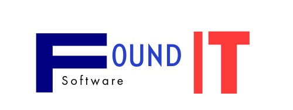

<p align="center">
	
</p>

# Found It — Gestión de Inventario y Reportes (Laravel + MongoDB)

Aplicación web para la gestión de materiales, almacenes y reportes operativos. Permite filtrar por almacén y tipo de movimiento, consultar historial de movimientos por material (incluye fecha, tipo, cantidad y usuario), y generar reportes con exportación CSV. Interactúa con una API externa para obtener información actualizada y usa MongoDB como base de datos.

## Funcionalidades principales

- Inventario de materiales con filtros por:
	- Almacén y tipo de movimiento (Entrada/Salida)
	- Búsqueda por nombre o código
- Historial de movimientos por material en un modal reutilizable:
	- Muestra Fecha (creación/actualización), Tipo, Cantidad y Usuario
	- Filtros rápidos dentro del modal
- Reportes de materiales:
	- Filtros por período (día, semana, mes, todos), tipo de movimiento y búsqueda
	- Exportación a CSV
- UI con Tailwind CSS y Vite

## Requisitos previos

- PHP 8.2+
- Composer 2+
- Node.js 18+ y npm 9+
- MongoDB (local o remoto)

## Instalación y configuración

1) Clonar el repositorio y entrar al proyecto

```powershell
git clone <URL_DEL_REPO>
cd foundit-app
```

2) Instalar dependencias de PHP y JavaScript

```powershell
composer install
npm install
```

3) Configurar el entorno (.env)

```powershell
copy .env.example .env
php artisan key:generate
```

Configura la conexión a MongoDB (ajústalo a tu entorno):

```env
DB_CONNECTION=mongodb
DB_HOST=127.0.0.1
DB_PORT=27017
DB_DATABASE=foundit
DB_USERNAME=
DB_PASSWORD=
```

Si usas cadena de conexión DSN, puedes emplear `MONGODB_URI` en vez de host/puerto/usuario/clave.

Configura también la API externa (si aplica):

```env
EXTERNAL_API_BASE_URL=http://localhost:3000
EXTERNAL_API_TIMEOUT=30
```

4) Añadir/Confirmar dependencia de MongoDB para Laravel

El proyecto ya incluye `jenssegers/mongodb`. Si fuese necesario reinstalarla:

```powershell
composer require jenssegers/mongodb
```

5) Tailwind CSS (si aún no está inicializado en tu entorno)

```powershell
npm install -D tailwindcss postcss autoprefixer
npx tailwindcss init -p
```

6) Ejecutar en desarrollo

La forma recomendada (usa el script que levanta servidor Laravel, queue y Vite en paralelo):

```powershell
composer run dev
```

Alternativas manuales si lo prefieres:

```powershell
php artisan serve
npm run dev
```

Para compilar assets en producción:

```powershell
npm run build
```

## Estructura rápida de rutas/ vistas clave

- Inventario: `resources/views/inventory/materiales.blade.php`
- Reportes: `resources/views/reporte/index.blade.php`
- Modal de historial reutilizable: `resources/views/layouts/movements_modal.blade.php`
- Endpoint historial JSON: `routes/web.php` → `MaterialesController@historialMovimientos`

## Tips y solución de problemas

- Si el historial no abre o no carga datos, verifica en la consola del navegador:
	- Que exista `window.openMovementsModal`
	- Que la petición a `/materiales/{id}/movimientos` devuelva `success: true`
- Limpieza de cachés de Laravel si ves comportamientos extraños:

```powershell
php artisan optimize:clear
```

## Licencia

Este proyecto se distribuye bajo licencia MIT.

## Autor
Proyecto Desarrollado con fines Educativos "UTJ" Universidad Tecnologica de Jalisco (Team) SIXTH MIND
